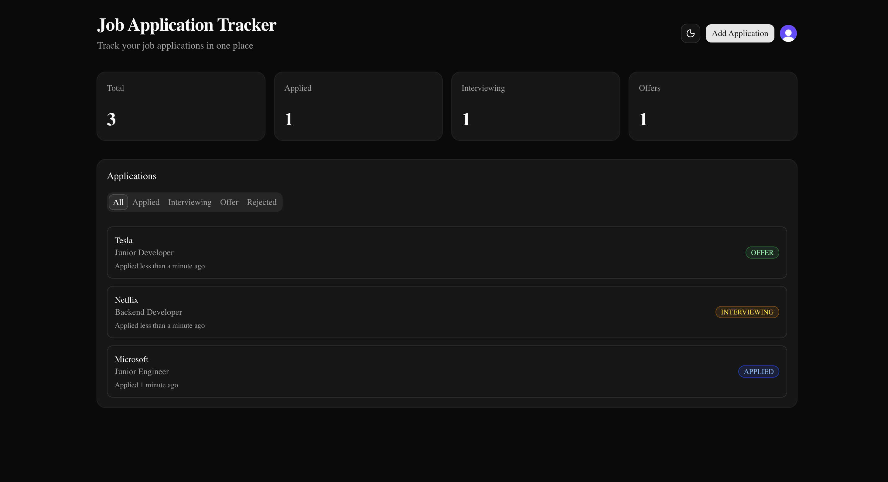
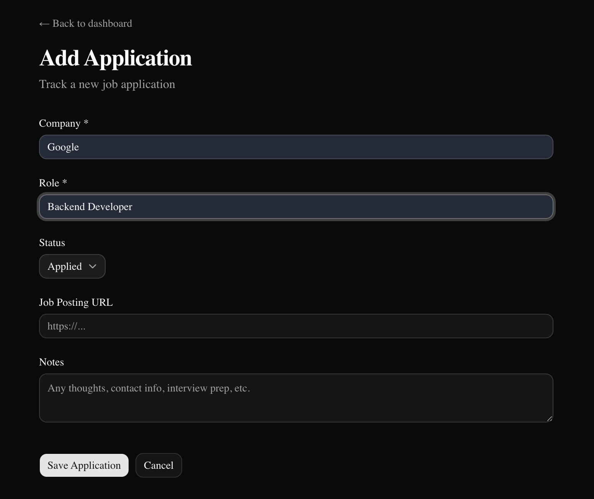
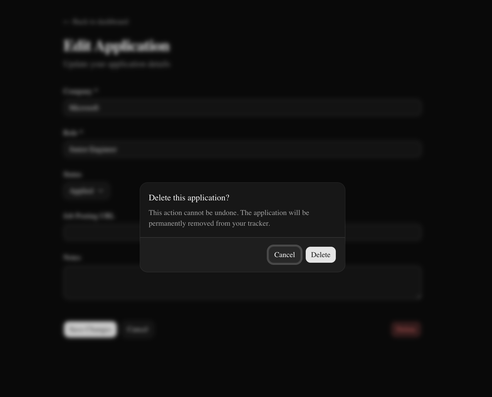
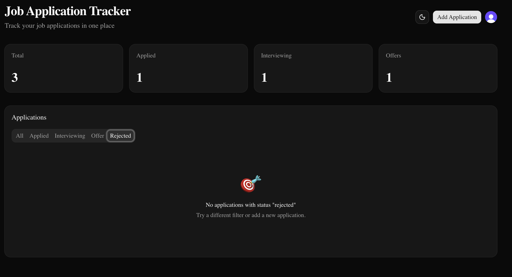

# 🎯 Job Application Tracker

A modern, full-stack web app to track your job applications with authentication, status filtering, and a clean dashboard.

**Live demo:** [job-tracker-zeta-three.vercel.app](https://job-tracker-zeta-three.vercel.app)

---

## Features

- 🔐 **Authentication** — Sign up / sign in with email or Google via Clerk
- 📊 **Real-time dashboard** — Stats for total, applied, interviewing, and offers
- ✏️ **Full CRUD** — Create, read, update, and delete applications
- 🏷️ **Status filtering** — Filter by Applied / Interviewing / Offer / Rejected
- 🌙 **Dark mode** — Auto-detects system preference, with manual toggle
- 📅 **Relative dates** — "Applied 5 days ago" instead of raw timestamps
- 🛡️ **Per-user data isolation** — Users only see their own applications
- 📱 **Responsive** — Works on desktop and mobile

---

## Tech Stack

| Layer              | Technology                 |
| ------------------ | -------------------------- |
| **Framework**      | Next.js 16 (App Router)    |
| **Language**       | TypeScript                 |
| **Styling**        | Tailwind CSS 4 + shadcn/ui |
| **Authentication** | Clerk                      |
| **Database**       | PostgreSQL on Neon         |
| **ORM**            | Prisma 7                   |
| **Hosting**        | Vercel                     |
| **Icons**          | Lucide React               |
| **Date handling**  | date-fns                   |

---

## Screenshots

### Add a new application

### Confirm before deleting

### Custom empty state with filtering

---

## Local development

### Prerequisites

- Node.js 20+
- A free Neon account for the database
- A free Clerk account for auth

### Setup

Clone the repo, install dependencies, set up environment variables, run migrations, and start the dev server:

- git clone https://github.com/khairagurinder9/job-tracker.git
- cd job-tracker
- npm install
- cp .env.local.example .env.local (then edit with your keys)
- npx prisma migrate dev
- npm run dev

Visit http://localhost:3000 to see it running.

### Environment variables

Create .env.local with:

- DATABASE_URL — your Neon connection string
- NEXT_PUBLIC_CLERK_PUBLISHABLE_KEY — from clerk.com
- CLERK_SECRET_KEY — from clerk.com

---

## Architecture highlights

- **Server Components + Server Actions** for direct database access without client-side state management
- **Middleware-based auth** with Clerk protecting routes before they render
- **Per-user data isolation** with ownership checks on update/delete operations
- **Connection pooling** on Neon for efficient serverless database connections
- **URL-based filter state** for shareable, bookmarkable filtered views

---

## Future improvements

- [ ] Search applications by company name
- [ ] Export to CSV / PDF
- [ ] Application analytics (response rate, average time to interview)
- [ ] AI-powered resume matcher
- [ ] Email reminders for follow-ups

---

## Author

**Gurinder Khaira**

- GitHub: [@khairagurinder9](https://github.com/khairagurinder9)
- Mohawk College, CS Technology - Software Development

---

## License

MIT
